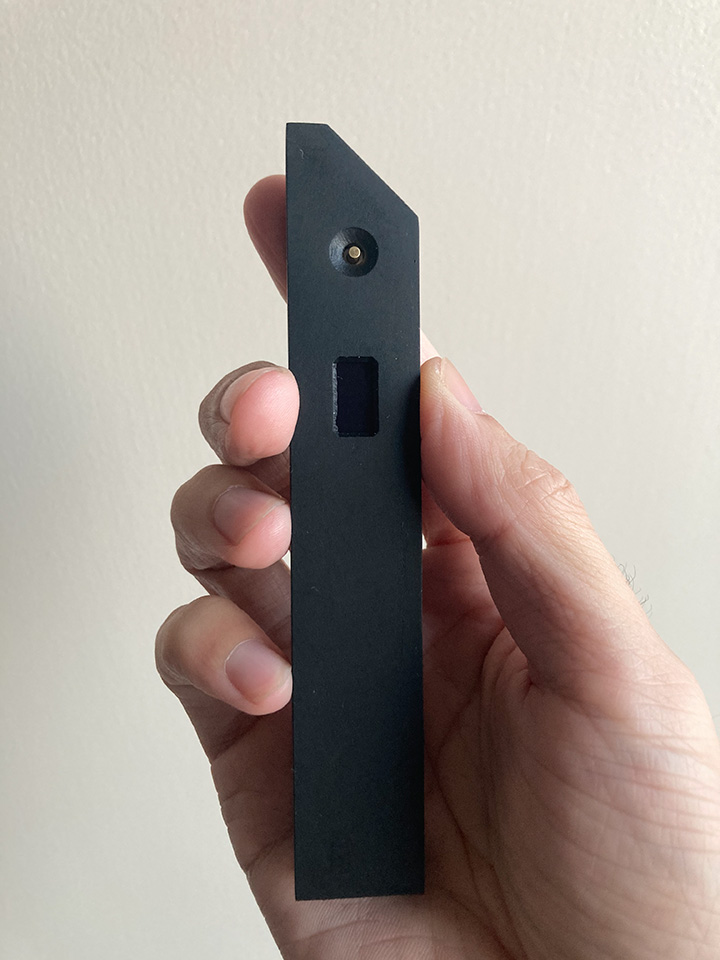

工作原理：

> 使用一个光源，将光源和快门测试笔分别放在快门两侧，测量快门开闭时间，即是快门速度。
> 
> 显示精度0.1毫秒，传感器响应延迟小于0.1毫秒。

## 1. 确认光源

补光灯、手机手电筒，台灯，自然光等都可以作为光源。

确认方法：

1. 按下测试笔开关，点亮屏幕
2. 将笔尖对准光源，按下开关
3. 确认屏幕出现“Too Bright”，表示光源亮度足够

## 2. 测量

1. 相机快门放在光源前，快门测试笔尖放在快门另一侧（如果是带镜头的快门，使用镜头一侧对准测试笔），保持测试光源垂直照射在相机快门平面上
2. 按下测试笔开关，点亮屏幕
3. 再次按下开关，显示“Press Shutter”
4. 按下快门
5. 显示结果

## 常见问题处理

### 工程样机电池耗尽，无法充电或者充电后不开机：

焊下一根电池的连线，等几秒后重新焊接上。